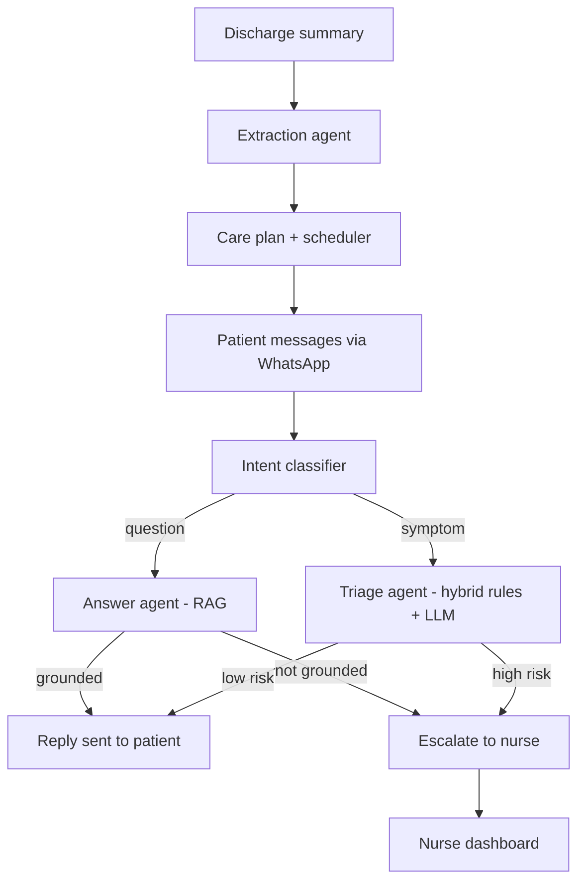

# Post-Discharge Patient Follow-Up Assistant

An agentic AI system that reads hospital discharge summaries, checks in on patients via WhatsApp, answers their recovery questions in plain language, and escalates to nursing staff when something needs human attention -- in both English and Urdu.

## The problem

A large share of hospital readmissions happen not because treatment failed, but because patients miss medications, don't recognize warning signs, or fall through the cracks after leaving the hospital. This system stays with the patient after discharge so they don't have to rely on a printed instruction sheet alone.

## How it works



Every patient message gets **two things simultaneously**: an honest, immediate reply on WhatsApp, and -- if the message is risky or the AI isn't confident -- a flagged entry on the nurse dashboard with full context and reasoning. The AI never silently guesses on something it's unsure about, and never leaves a nurse in the dark about why a case was flagged.

## Client requirements -> how each is met

| Requirement | Implementation |
|---|---|
| Handle medical documents | LLM tool-calling (function calling) extracts diagnosis, medications, follow-up date, and red-flag symptoms into a validated Pydantic schema -- not free-text parsing |
| Patient-friendly language | Answer agent explicitly instructed to avoid medical jargon, grounded only in the actual discharge document |
| Escalate when unsure | Two independent escalation paths: a triage agent for symptom risk, and a groundedness check on every answer -- an answer the AI can't confidently support escalates instead of guessing |
| English and Urdu | Intent classification, triage, and answering are all LLM-driven (not keyword-based), so they work correctly in either language |

## Architecture

- **`graph/`** -- the LangGraph state machine. Four LLM-backed agents (extraction, intent classification, hybrid triage, grounded Q&A), each in its own file, each going through one shared provider-agnostic interface (`llm_provider.py`) instead of a hardcoded vendor SDK.
- **`storage.py`** -- SQLite persistence: patient care plans, phone numbers, and a full log of every check-in with escalation reasoning.
- **`webhook.py`** -- FastAPI server: receives inbound WhatsApp messages (Meta Cloud API), runs them through the graph, replies, and serves a live nurse dashboard at `/dashboard`.
- **`scheduler.py`** -- APScheduler job for daily automated check-ins, with a dry-run fallback when messaging credentials aren't configured.
- **`messaging.py`** -- WhatsApp send logic via Meta's Cloud API.

## Tech stack

Python, LangGraph, LangChain, Pydantic, FastAPI, SQLite, APScheduler, Meta WhatsApp Cloud API. LLM provider is swappable between Anthropic Claude and Groq (free tier) via a single environment variable -- every prompt file is written against one shared interface, not a specific vendor's SDK.

## Design decisions worth knowing about

- **Hybrid triage, not pure LLM judgment.** A deterministic keyword check runs first for safety-critical speed and reliability; the LLM only handles ambiguous or non-English cases. This means Urdu messages currently rely entirely on the LLM path, since the rule-based fast path only matches English keywords -- documented here rather than hidden, since it's a real, known property of the current design.
- **Context-stuffing instead of a vector database for Q&A.** A single discharge document is short enough to fit entirely in the model's context window, so retrieval-augmented generation here means "give the model the whole document," not "embed and search chunks." A real vector store would earn its complexity once this searches a patient's full multi-visit history.
- **One real bug found and fixed during testing:** the rule-based triage check originally compared a lowercased patient message against non-lowercased extracted red flags, causing a genuinely concerning message ("I have a fever") to be silently misclassified as low-risk. Caught during live testing, root-caused, fixed, and confirmed with a targeted re-test.

## Known limitations / what's next

- WhatsApp requires an approved message template for the *first* message a business sends someone (a platform-wide rule, not specific to this project) -- our proactive daily check-in would need an approved template for full production use; today's testing relies on the patient messaging first, which reopens a free-form reply window.
- Full outbound reach beyond the registered test number requires Meta Business Verification, which is a multi-day external review process, not something resolvable from the codebase.
- The nurse dashboard is a minimal read-only view; a production version would add authentication and a "mark resolved" action.
- Patient matching is currently by a single demo `patient_id`; a production version would look up the real patient by their WhatsApp number.

## Running it locally

```bash
python -m venv venv
venv\Scripts\activate          # Windows
pip install -r requirements.txt
```

Copy `.env.example` to `.env` and fill in your own API keys (Groq or Anthropic, plus Meta WhatsApp credentials if testing the live integration).

```bash
python main.py                              # run the graph against sample scenarios
uvicorn webhook:app --reload --port 8000     # run the live WhatsApp webhook + dashboard
python scheduler.py                          # manually trigger daily check-ins
```

Nurse dashboard: `http://localhost:8000/dashboard`