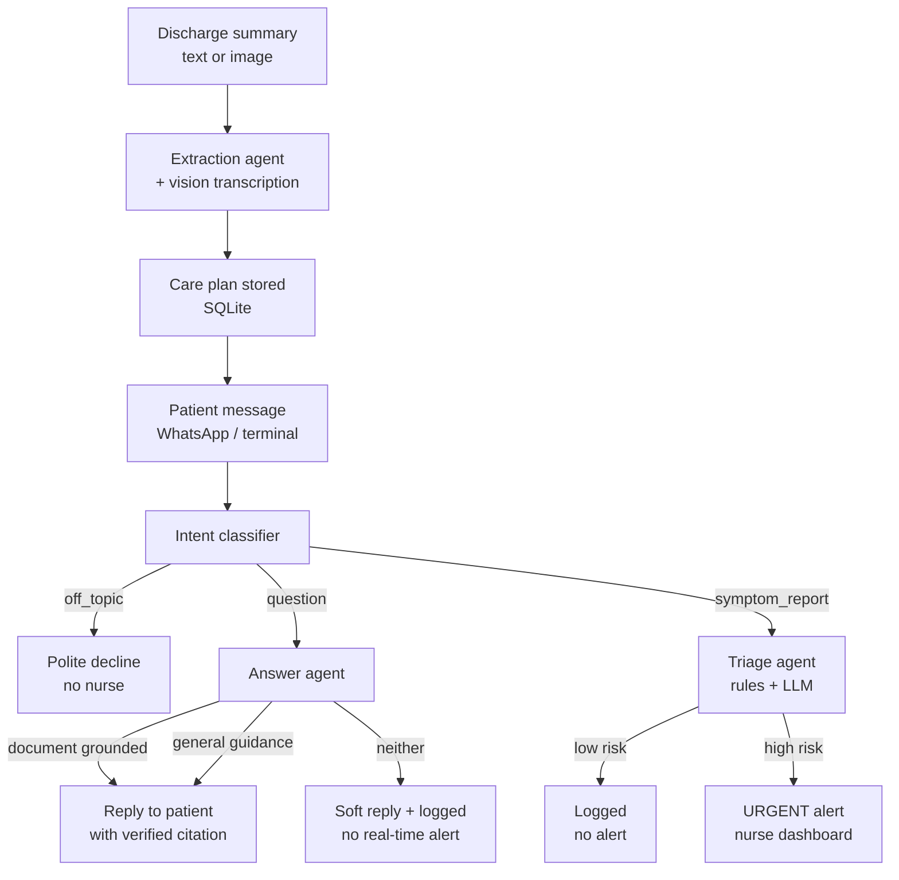

# Post-Discharge Patient Follow-Up Assistant

An agentic AI system that reads hospital discharge summaries, checks in on patients via WhatsApp, answers their recovery questions in plain language, and escalates to nursing staff **only when there is real symptom risk** -- in both English and Urdu.

## The problem

A large share of hospital readmissions happen not because treatment failed, but because patients miss medications, don't recognize warning signs, or fall through the cracks after leaving the hospital. This system stays with the patient after discharge so they don't have to rely on a printed instruction sheet alone.

## How it works



**The core design principle:** only high-risk symptoms trigger a real-time nurse alert. Questions are answered by the agent (from the document or from curated general guidance), and off-topic messages get a polite decline. The nurse queue is reserved for genuine risk -- not for routine questions and not for non-medical chatter.

## Client requirements -> how each is met

| Requirement | Implementation |
|---|---|
| Handle medical documents | LLM tool-calling extracts diagnosis, medications, follow-up date, and red-flag symptoms into a validated Pydantic schema. Images supported via a two-step vision-transcription → extraction pipeline. |
| Patient-friendly language | Answer agent explicitly instructed to avoid medical jargon. Every grounded answer must quote the exact source sentence from the document; the code independently verifies the quote exists before returning it. |
| Escalate when unsure | Three-tier escalation: (1) document-grounded answers with verified citations, (2) curated general guidance for common questions, (3) soft reply + low-priority log when neither covers it. Only symptom triage escalates to a nurse in real time. |
| English and Urdu | Intent classification, triage, and answering are LLM-driven (not keyword-based), so they work correctly in either language. |

## Architecture

- **`graph/`** -- the LangGraph state machine. All LLM-backed agents (extraction, intent classification, hybrid triage, grounded Q&A) share one provider-agnostic interface (`llm_provider.py`) rather than a hardcoded vendor SDK.
- **`graph/intent.py`** -- three-way classifier: `question` | `symptom_report` | `off_topic`.
- **`graph/triage.py`** -- hybrid triage: deterministic keyword check first, LLM judgment fallback for ambiguous cases.
- **`graph/answering.py`** -- three-layer answer pipeline with code-verified citations (see "Hallucination prevention" below).
- **`general_guidance.py`** -- curated knowledge base of common recovery questions. Content is placeholder and **must be replaced with clinician-approved text before real use**.
- **`storage.py`** -- SQLite persistence: care plans, phone numbers, and a full audit log of every check-in with escalation reasoning.
- **`webhook.py`** -- FastAPI server: receives inbound WhatsApp messages (Meta Cloud API), runs them through the graph, replies, and serves a live nurse dashboard at `/dashboard`.
- **`scheduler.py`** -- APScheduler job for daily check-ins, with a dry-run fallback when messaging credentials aren't configured.
- **`messaging.py`** -- WhatsApp send logic via Meta's Cloud API.
- **`interactive_test.py`** -- terminal walkthrough of the full pipeline against a real discharge image.

## Tech stack

Python, LangGraph, LangChain, Pydantic, FastAPI, SQLite, APScheduler, Meta WhatsApp Cloud API. LLM provider is swappable between Anthropic Claude and Groq (free tier) via a single environment variable -- every prompt file is written against one shared interface, not a specific vendor's SDK.

## Hallucination prevention -- the concrete mechanism

The answer agent is not trusted to self-report confidence. Instead:

1. The LLM must return an `answer` **and** a `source_quote` copied verbatim from the discharge document.
2. Code (`_verify_quote` in `answering.py`) independently checks that the quote actually appears in the document, normalized for whitespace and case.
3. If the quote cannot be verified, the answer is discarded and the agent falls through to the general-guidance layer or a soft reply.

This means an invented quote -- even if the model sets `grounded=True` -- is caught and does not reach the patient. **The model does not decide whether it is hallucinating; the code does.**

## Design decisions worth knowing about

- **Hybrid triage, not pure LLM judgment.** A deterministic keyword check runs first for speed and reliability; the LLM only handles ambiguous or non-English cases. Urdu messages currently rely entirely on the LLM path, since the rule-based fast path only matches English keywords -- documented here rather than hidden, since it's a real property of the current design.
- **Context-stuffing instead of a vector database for Q&A.** A single discharge document is short enough to fit entirely in the model's context window, so grounding here means "give the model the whole document," not "embed and search chunks." A vector store would earn its complexity once this searches a patient's full multi-visit history.
- **Provider-agnostic LLM calls.** `llm_provider.py` abstracts Anthropic and Groq behind one `call_structured` interface. Switching providers is a single env-var change; no calling code knows which vendor answered.
- **Retry on malformed tool calls.** Groq's strict validator occasionally rejects a response when the model returns medications in an unexpected shape. A fallback schema with looser typing catches this and retries once -- documented as a real production concern, not a hidden patch.
- **Real bugs found and fixed during testing:**
  - **Case-sensitivity in triage rules**: the rule-based check originally compared a lowercased patient message against non-lowercased extracted red flags, causing a genuinely concerning message ("I have a fever") to be silently misclassified as low-risk. Caught in live testing, root-caused, fixed, confirmed with a targeted re-test.
  - **Nurse alert flooding**: initially every ungrounded answer escalated to the nurse dashboard. Testing against real documents showed this would drown the queue in non-urgent items. Fixed with the three-tier escalation model -- off-topic questions declined, low-confidence questions logged for batch review, only symptom risk alerts in real time.
  - **Non-deterministic extraction**: running the same image multiple times produced different medication counts. Documented with before/after runs. A production fix would add a deterministic cross-check (count medication-like patterns in raw text and compare against the model's output), not rely on prompt wording alone.

## Known limitations / what's next

- **General guidance content is placeholder.** Every entry in `general_guidance.py` must be replaced with clinician-approved text before this touches real patients. The architecture lets that content be swapped without changing any code.
- **Non-deterministic LLM extraction.** The model occasionally drops a medication across runs. A prompt instruction reduces this; it does not eliminate it. Production needs a code-level cross-check.
- **WhatsApp template requirement.** Meta requires an approved message template for the first business-initiated message to a user. Proactive daily check-ins would need an approved template for full production use; today's testing relies on the patient messaging first, which reopens a free-form reply window.
- **Outbound reach beyond the test number** requires Meta Business Verification -- a multi-day external review process, not a codebase problem.
- **Nurse dashboard is read-only.** A production version would add authentication and a "mark resolved" action.
- **Patient matching** is currently by a single demo `patient_id`. Production would look up the patient by their WhatsApp number.

## Running it locally

```bash
python -m venv venv
venv\Scripts\activate          # Windows
pip install -r requirements.txt
```

Copy `.env.example` to `.env` and fill in your own API keys (Groq or Anthropic, plus Meta WhatsApp credentials if testing the live integration).

```bash
python main.py                                  # run the graph against sample scenarios
python interactive_test.py data\01_st.jpg       # interactive pipeline walkthrough
uvicorn webhook:app --reload --port 8000        # live WhatsApp webhook + dashboard
python scheduler.py                             # manually trigger daily check-ins
```

Nurse dashboard: `http://localhost:8000/dashboard`